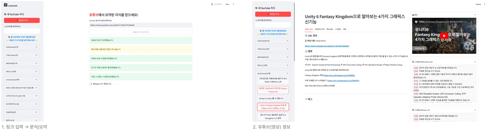
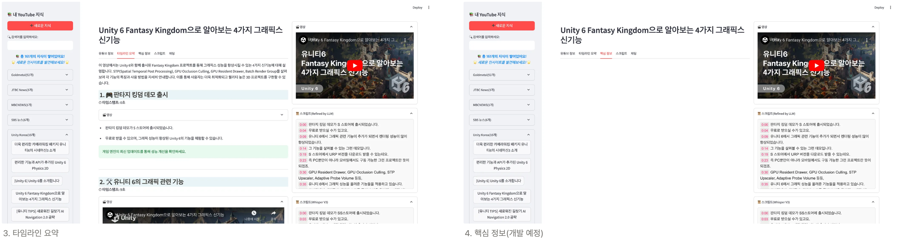
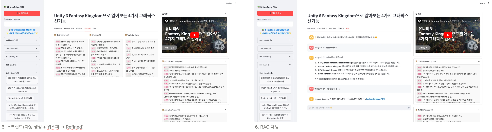

# LemenaAI: 유튜브 요약/분석 서비스

### [LilysAI](https://lilys.ai/home) 유튜브 요약 서비스 따라 만들기 프로젝트

### 1. Demo Video
https://www.youtube.com/watch?v=oxmqXq-U5nE
[](https://www.youtube.com/watch?v=oxmqXq-U5nE)
---

## 2. Preview



---

## 3. Development

### `DDD & Dependency Injection`

이 프로젝트는 **DDD(Domain-Driven Design)** 및 **의존성 주입(Dependency Injection)** 원칙에 따라 설계되었습니다. 각 모듈은 책임에 따라 명확히 구분되어 있으며, 의존성은 컨테이너를 통해 관리되어 유지보수성과 확장성이 높아집니다. 또한 계층이 명확히 분리되어 있어 **Streamlit** 외에도 **FastAPI**, **Django**와 같은 다양한 파이썬 프레임워크로 쉽게 확장할 수 있습니다. 

**프로젝트 폴더 구조:**

```python
LumenaAI
├── main.py           # 어플리케이션 실행 파일(streamlit 진입점)
├── app               # 어플리케이션 레벨의 코드 (의존성 주입 컨테이너, 어플리케이션 등)
├── asset             # 정적 자산 및 리소스 (이미지, 동영상, 문서 등)
├── chroma_data       # ChromaDB에 저장되는 데이터
├── data              # 공통적으로 사용하는 데이터 및 설정 파일
├── domain            # 도메인 로직 및 엔티티
├── downloads         # 다운로드 관련 파일 저장 경로(유튜브 오디오 파일)
├── infrastructure    # 외부 인프라, 데이터베이스 및 저장소 설정
│   ├── database      # 데이터베이스 관련 코드
│   └── repository    # 저장소 패턴 구현 코드
├── service           # 서비스 레이어
├── strategy          # 다양한 전략 패턴 관련 코드 (유연한 기능 확장을 위한 모듈, STT, LLM 등)
├── test_execute      # 테스트 실행 관련 코드 및 스크립트(주피터 환경)
├── use_case          # 주요 유스케이스 및 응용 서비스 코드
├── .env              # 환경 변수 설정 파일
├── .gitignore        # Git 무시 파일 설정
├── execute_requirements.ipynb  # 필수 패키지 실행 및 관리 스크립트
└── README.md         # 프로젝트 소개 및 설명 문서
```

**어플리케이션 레벨 의존성 주입:**

- 코드 링크: [AppContainer](https://github.com/adunStudio/LumenaAI/blob/main/app/app_container.py)

### `STT & LLM Strategy Pattern`

또한, **전략 패턴(Strategy Pattern)**을 적용하여 **Whisper**, **LLM** 등의 모델을 다양한 환경에 맞게 실행 중 손쉽게 교체할 수 있습니다. 예를 들어, 현재는 **OpenAI Whisper** 및 **GPT** 모델을 사용하고 있지만, 로컬 환경의**Whisper 모델** 이나 다른 L**LM** 으로도 간단한 설정 변경만으로 교체할 수 있습니다.

- 코드 링크:  [Strategy](https://github.com/adunStudio/LumenaAI/tree/main/strategy)
- 사용 목적:
    1. 다양한 모델의 비교/분석 용이 
    2. 향후 무료or유료 사용자 간의 차별화된 모델 사용

---

## 4. Use-Case

프로젝트는 다양한 유즈 케이스와 서비스 기능을 제공하여 유튜브 콘텐츠를 처리하고 인공지능을 활용한 자동화 기능을 구현합니다. 아래는 각 유즈 케이스 및 서비스에 대한 설명과 해당 소스 코드 링크입니다.

### 1. `YouTubeParseAndStore`

- 유튜브 콘텐츠 메타데이터를 파싱하고 저장하는 기능입니다.
- **코드 링크**: [YouTubeParseAndStore](https://github.com/adunStudio/LumenaAI/blob/main/use_case/youtube_parse_and_store.py)

### 2. `YouTubeAutoScriptParse`

- 유튜브 자동 생성 자막을 파싱하여 저장하는 기능입니다.
- **코드 링크**: [YouTubeAutoScriptParse](https://github.com/adunStudio/LumenaAI/blob/main/use_case/youtube_auto_script_parse.py)

### 3. `YouTubeAudioDownload`

- 유튜브 영상의 오디오 파일을 다운로드하는 기능입니다.
- **코드 링크**: [YouTubeAudioDownload](https://github.com/adunStudio/LumenaAI/blob/main/use_case/youtube_audio_download.py)

### 4. `Whisper: AudioSTT`

- 오디오 파일을 사용하여 **Whisper**를 통한 음성 인식(STT)을 수행합니다.
- **코드 링크**: [YouTubeAudioSTT](https://github.com/adunStudio/LumenaAI/blob/main/use_case/youtube_audio_stt.py)

### 5. `LLM: Refine Script`

- **LLM**(Language Model)을 사용하여 기존 스크립트를 정제하고 보다 매끄러운 자막을 생성합니다.
- **코드 링크**: [YouTubeScriptRefinement](https://github.com/adunStudio/LumenaAI/blob/main/use_case/youtube_script_refinement.py)

### 6. `LLM: Generate TimelineSummary`

- **LLM**을 활용하여 유튜브 영상의 타임라인 요약 정보를 생성합니다.
- **코드 링크**: [YouTubeGenerateTimelineSummary](https://github.com/adunStudio/LumenaAI/blob/main/use_case/youtube_generate_timeline_summary.py)

### 7. `LLM: Generate KeyPoint`

- **개발 예정**: 영상의 핵심 키포인트를 생성하는 기능.

### 8. `LLM: RAG Chat`

- **Retrieval-Augmented Generation (RAG)**을 활용하여 유튜브 영상 기반 채팅 응답을 생성합니다.
- **코드 링크**: [YouTubeChatService](https://github.com/adunStudio/LumenaAI/blob/main/service/youtube_chat_service.py)

---

# 5. 앞으로의 계획

- [ ]  **핵심 키포인트 생성 기능 개발**
    - LLM이 아닌 통계 기반 접근을 통한 핵심 키포인트 추출 기능 개발.
- [ ]  **다양한 로컬 모델 활용 및 매트릭스 분석**
    - Ollama 기반의 로컬 모델을 적용하여 다양한 환경에서 성능 분석 및 비교.
- [ ]  **프롬프트 최적화를 통한 최고의 요약 생성**
    - 프롬프트 엔지니어링을 통해 요약 품질을 극대화하고 효율적인 응답 생성 전략 개발.